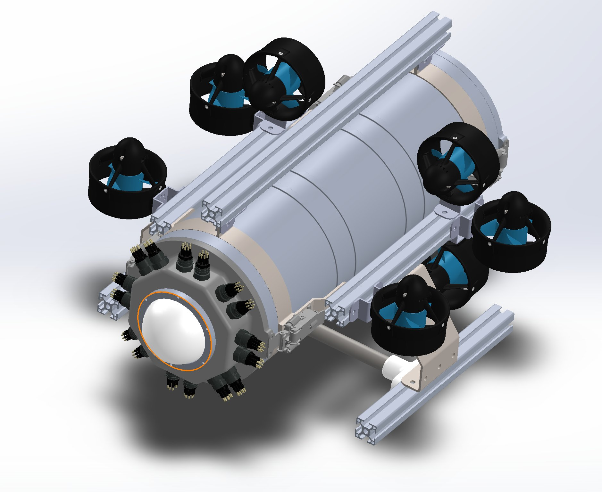

# Welcom to marron-UAV project.
## いったい何が始まるんです？
"Massive Radical Reaction Open Nautilus"

水中機がお好き？　結構！では、ますます好きになりますよー。
MARRON-AUV は日本で生まれました。アメリカの製品ではありません。
我が国のオリジナルです。 しばし、遅れをとりましたが 今や巻き返しの時です。

んあぁぁ、おっしゃらないで。 アクションやプロジェクト進行は大雑把、
でも繊細な描写なんて考察が必要だし、重い気分になるわ、脳みそは疲れるわ、
ろくなことがない。 ツッコミどころもたくさんありますよ。
どんだけ疲れてても大丈夫。どうぞ観てみてください。 いいマシンでしょう？
最高のオモチャだ、正気度が違いますよ！ 

## 続きはWebで！

<blockquote class="embedly-card"><h4><a href="https://marron-auv.github.io/marron-auv/">Marron AUV Project</a></h4>
オープン・シェアリング・開発・運用　AUVプロジェクト! AUVは、Autonomous Underwater Vehicle ( 自律型 無人 潜水機 )です。 一般的な水中ドローン（ROV）は、テザーケーブルと繋がれ、遠隔操縦によりカメラによる視点を提供するものです。 AUVは、あらかじめ与えられた目的に応じたプログラムにより、自律的に行動し、テザーケーブルを必要としません。 AUVは真の孤独と自由を併せ持つ、海のロボットです。 しかしながらまだまだAUVは高価で、ひとりで作り運用し・楽しむのは困難が伴います。 このAUVプロジェクトは、学生から社会人まで、色んな人がワイワイ開発をするための趣味のAUVとして生まれました。 参加資格 興味を持ち・自ら進んで行動し・困難においても糸口を探し続ける志を持つ者。 本体の基本的な所有権：@Shoo Attention 追加の装備を勝手に搭載する分にはこの限りではありません。 もちろん自律機の性質上、機体ごと、なくなったり・壊したりしても一切の責任を持ちません。 当然、それを作った人に帰属します、公開する範囲、ライセンスは自由に設定できます。 何も制限するつもりはありません。 あえて言えば楽しむことが大事です。 既存の挑戦者が優先されますが、作業にドロップインすることは歓迎です。 実費・許認可等は、運用者がご負担・申請ください。 Do it your Self。トラブルこそ楽しみのうちです。困難な時は仲間が助けてくれるでしょう。 歴史的経緯 2019年 WebRTC Native Client Momoを用いた、動画配信用ROVとして機体は設計されました。 同年、なんとか孤独な進水式こぎつけるもの、皆さん知る通りCOVID-19社会情勢の中で運用が断念され、 そのままホコリを被っていました...。 やがて置き場所を失った機体は、バラバラにされてスクラップ置き場に送られました。 スクラップの中から使えるものを再生・加工・部品を新造し、テセウスの船のごとく復活を遂げました。 I can't tell all the stories, but I'll try to keep as many records and memories of my challenges here as I can.
</blockquote>
